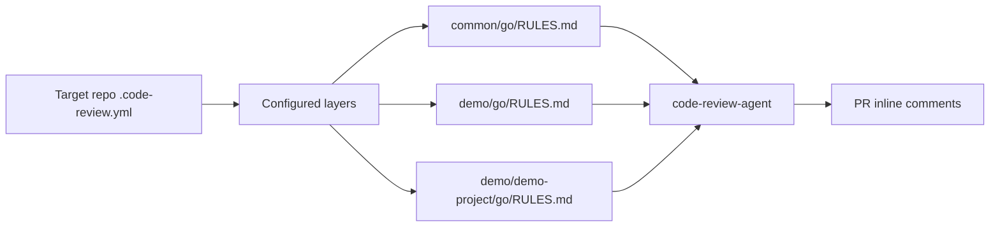
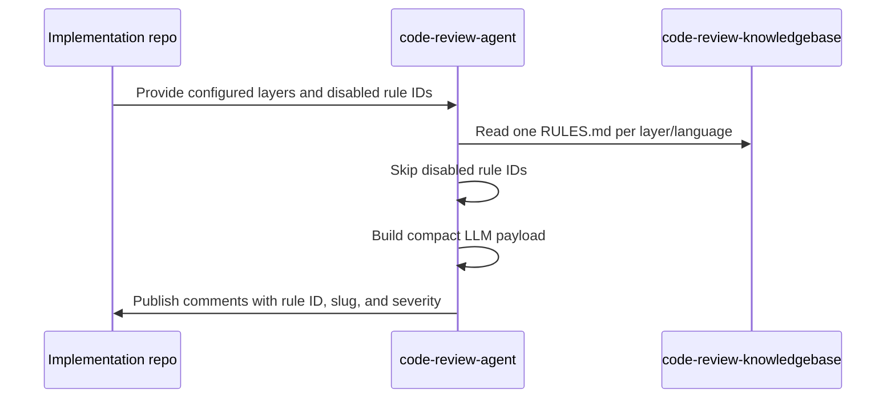

# Code Review Knowledgebase

Markdown coding-rule repository for the intelligent code review demo.

This repo stores reusable engineering knowledge only. It does not store PRD/TDD summaries, business requirement artifacts, generated review reports, or executable review-agent code.

## References

1. Agent / GitHub Action - [https://github.com/laughingkid-sg/code-review-agent](https://github.com/laughingkid-sg/code-review-agent)
2. Implementation Example - [https://github.com/laughingkid-sg/code-review-demo](https://github.com/laughingkid-sg/code-review-demo)
3. Knowledge Base Example - [https://github.com/laughingkid-sg/code-review-knowledgebase](https://github.com/laughingkid-sg/code-review-knowledgebase)

## Repository Role

- Store lightweight markdown rules for coding errors and implementation mistakes.
- Organize rules by common, department, and project layers.
- Keep one `RULES.md` per layer/language so CI can load a small number of files.
- Validate rule format in CI before rules are merged.
- Provide stable rule IDs used by PR comments and future analytics.

## Layering Model



Current demo layers:

| Layer | Purpose |
| --- | --- |
| `common/go` | Company-wide Go rules. |
| `demo/go` | Demo department Go rules. |
| `demo/demo-project/go` | Project-level Go rules for `code-review-demo`. |

Target repositories choose their layers in `.code-review.yml`.

## Rule Loading Flow



The compact LLM payload keeps review-critical content and removes governance metadata such as `Contributor`, `Tags`, and `References` to reduce token usage.

## Rule Format

Rules use pure markdown without YAML front matter. Each rule starts with a level-two linked heading, followed by a small field/value table and standard sections.

````markdown
## [Always close HTTP response bodies](#close-http-response-bodies)

| Field | Value |
| --- | --- |
| ID | `GO-COM-001` |
| Slug | `close-http-response-bodies` |
| Contributor | `example@gmail.com` |
| Severity | `P2` |
| Tags | `resource-management` |
| References | None |

### Rule

Describe the rule.

### Background

Explain why the issue appears.

### Risks

Explain correctness, security, reliability, performance, or maintainability risks.

### Review Checklist

Describe what reviewers and the agent should inspect.

### Good Example

```go
defer resp.Body.Close()
```

### Bad Example

```go
resp, _ := http.Get(url)
_ = resp
```

### Review Comment Guidance

Explain how the finding should be written to the developer.
````

## Required Fields

| Field | Meaning |
| --- | --- |
| `ID` | Stable identifier used in comments, suppressions, and analytics. |
| `Slug` | Stable anchor used for navigation and comments. |
| `Contributor` | Email of the rule contributor or substantial updater. |
| `Severity` | `P0`, `P1`, `P2`, or `P3`, where `P0` is most serious. |
| `Tags` | Lightweight grouping labels. |
| `References` | Optional supporting links or `None`. |

Do not add `Owner`, `Level`, `Scope`, or `Language`. Scope and language come from the path, and severity replaces level.

## Severity

| Severity | Meaning |
| --- | --- |
| `P0` | Critical security, data loss, outage, or severe production risk. |
| `P1` | Likely correctness, reliability, or security issue. |
| `P2` | Maintainability, observability, performance, or moderate correctness risk. |
| `P3` | Readability, consistency, or minor improvement. |

## Validation

Rule changes are checked by `.github/workflows/validate-rules.yml`, which runs `scripts/validate_rules.py`.

The validator checks:

- every rule uses a linked markdown heading.
- required metadata fields are present.
- IDs match the expected path prefix.
- slugs are unique and match heading anchors.
- contributor values are email addresses.
- severity is one of `P0`, `P1`, `P2`, `P3`.
- required rule sections exist.
- YAML front matter and deprecated fields are not used.

Run locally from this repo:

```bash
python3 scripts/validate_rules.py
```

## Suppressing Rules

Rules can be disabled by ID in a target repository:

```yaml
knowledge:
  disabled_rules:
    - GO-COM-001
```

Suppressions should be rare. Prefer narrowing or improving a rule when it creates repeated false positives across repositories.

## Governance and Future Improvements

- Use stable IDs because comments, suppressions, and future metrics depend on them.
- Promote project rules to department or common layers when they become broadly useful.
- Merge duplicate or overlapping rules based on measured effectiveness.
- Export finding consumption data to an external Hive table.
- Use Hive-backed analysis to measure rule effectiveness, false positives, resolved findings, unresolved findings, consumption rate, and non-consumption rate.
- Treat developer reactions such as upvotes/downvotes as optional future feedback signals.
